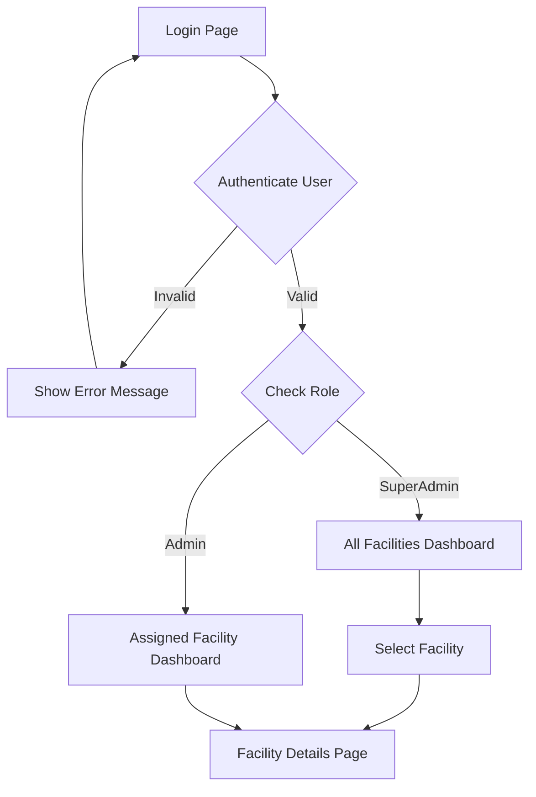
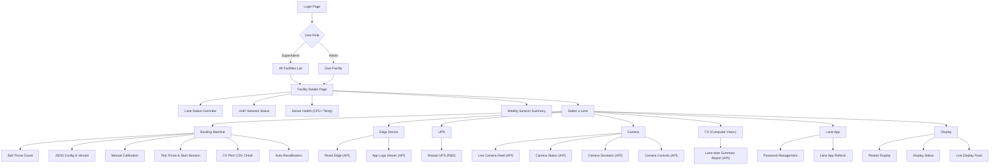
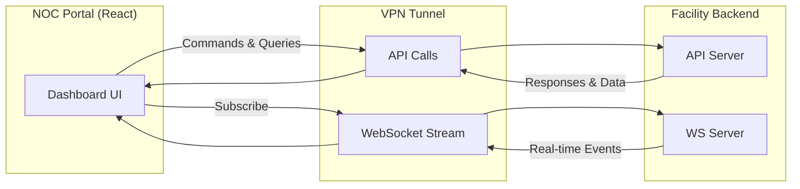

# NOC Portal — Product Requirements Document

## 1. Overview

The NOC (Network Operations Centre) Portal is an internal web application designed to provide real-time monitoring, diagnostics, and control over all facility operations. The portal connects to the facility server through a secure VPN tunnel and communicates via REST APIs and WebSocket connections. It supports role-based access to ensure that each user sees only what is relevant to their scope.

---

## 2. System Architecture

The portal follows a client-server architecture with two communication channels:

- **API Server** — Handles all request-response interactions such as fetching facility data, triggering calibrations, restarting devices, and retrieving reports.
- **WebSocket Server** — Provides real-time updates for lane status, camera feeds, device health, and live session data.

## 3. Authentication & Role Management

The portal supports two user roles with distinct access levels:

| Role | Access Scope | Description |
|------|-------------|-------------|
| **SuperAdmin** | All facilities | Can view and manage every facility registered in the system. Has access to cross-facility dashboards and aggregated reports. |
| **Admin** | Assigned facility only | Can view and manage only the facility they are assigned to. All data, lanes, and resources are scoped to their facility. |

Both roles authenticate through a shared login page. Upon successful login, the system determines the user's role and redirects them to the appropriate dashboard view.

### 3.1 Authentication Flow

---

## 4. Facility Details Page

Once a user selects or is assigned to a facility, the facility details page serves as the primary dashboard. It displays the following information:

### 4.1 Lane Status
A summary view showing the online or offline status of every lane within the facility.

### 4.2 UniFi Status
A quick-glance indicator of the UniFi network infrastructure at the facility. Includes a redirect link that navigates the operator directly to the UniFi dashboard for detailed network management.

### 4.3 Server Health
Real-time server metrics including CPU usage and temperature readings. This section requires a dedicated backend API to fetch hardware telemetry.

> **Dependency:** Backend API required for server health metrics.

### 4.4 Weekly Summary
A summary of facility activity and session data for the current week, providing a quick snapshot of operational throughput.

> **Dependency:** Backend API required for weekly session summary data.

---

## 5. Lane & Resource Details

Each lane within a facility contains multiple hardware and software components. The portal provides a dedicated resource management interface for every lane, organised into the following modules.

### 5.1 Complete User Flow Diagram

### 5.2 Bowling Machine

This module provides full visibility and control over the bowling machine attached to each lane.

- **Ball throw count** — Displays the total number of balls delivered by the machine.
- **JSON configuration details** — Shows the current machine configuration in the same format used by the admin portal, including the JSON version number.
- **Calibration** — Supports manual calibration with an option to trigger a test throw and start a session to validate accuracy.
- **CV pitch CSV check** — Allows the operator to inspect the computer vision pitch data in CSV format for verification.
- **Auto-recalibration** — A one-click trigger to initiate the automated recalibration process.

### 5.3 Edge Device

This module provides basic control and log access for the edge computing device at each lane.

- **Reset edge** — A single button to restart the edge device remotely.
- **Application logs** — A log viewer that displays logs for all applications running on the edge device.

> **Dependency:** Backend APIs required for edge reset and log retrieval.

### 5.4 UPS

This module allows operators to restart the UPS unit, particularly when camera systems experience issues like out of focus

- **Restart UPS** — A button to trigger a UPS restart.

> **Dependency:** R&D required. The feasibility of remotely restarting the UPS hardware needs to be investigated before implementation.

### 5.5 Camera

This module provides comprehensive camera monitoring and control for each lane.

- **Live camera feed** — Streams the real-time video feed from the lane camera.
- **Camera status** — Displays the current operational status of the camera (online, offline, or error state).
- **Camera deviation** — Shows any detected deviation in camera alignment or positioning.
- **Camera controls** — Provides remote control capabilities for camera adjustments.

> **Dependency:** Backend APIs required for all four camera features (feed, status, deviation, and controls).

### 5.6 Computer Vision (CV)

This module surfaces the output of the computer vision system.

- **Lane-wise summary report** — A report summarising CV processing results for each lane, including detection accuracy and session metrics.

> **Dependency:** Backend API required for the CV summary report.

### 5.7 Lane Application

This module manages the software running on the lane-side application.

- **Password management** — Password management functionality for the admins, allowing operators to reset or update lane application credentials.
- **Lane app refresh** — A button that triggers a remote refresh of the lane application without requiring physical access.

### 5.8 Display

This module monitors and controls the display unit connected to each lane.

- **Restart display** — A button to remotely restart the display hardware.
- **Display status** — Shows whether the display is active, inactive, or in an error state.
- **Live display feed** — Streams a real-time view of what is currently being shown on the display.

---

## 6. Data Flow Diagram

This diagram shows how data flows between the NOC portal and the facility hardware through the API and WebSocket layers.

